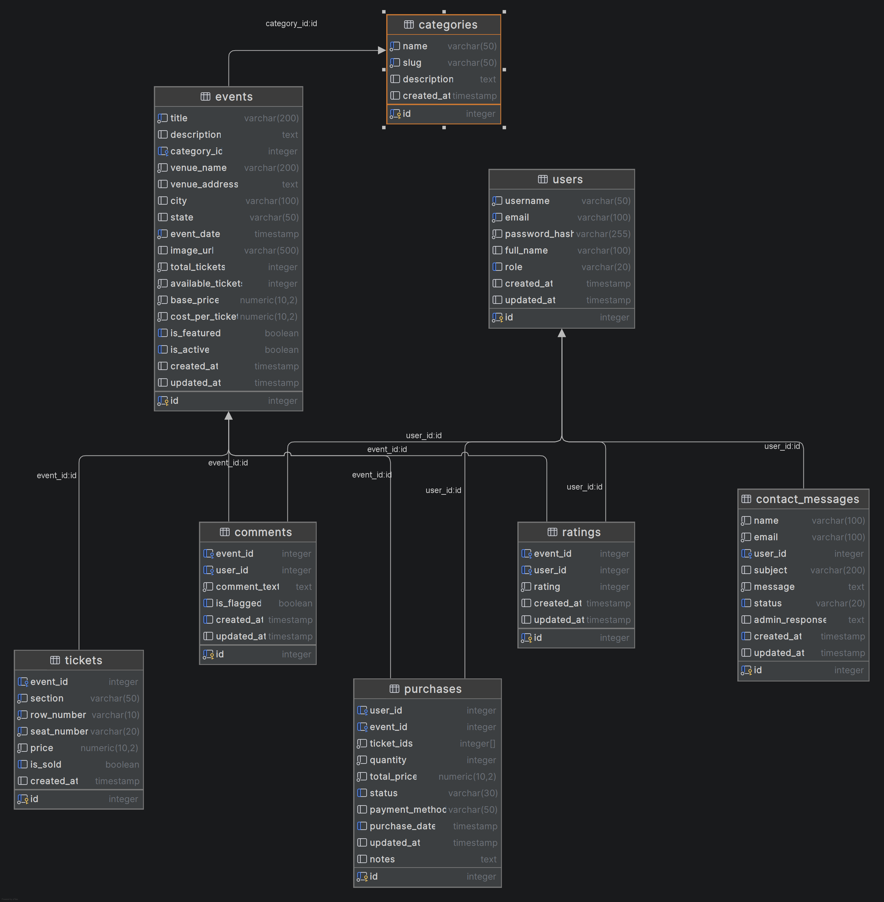

# Seat Master

A full-stack event ticketing platform built with Node.js, Express, EJS, and PostgreSQL. Seat Master allows customers to browse events, select seats, and purchase tickets, while staff manage the event catalog, monitor purchases, and track revenue.

---

## Project Description

Seat Master is designed for a small-to-medium ticketing operation that needs to sell event tickets directly to the public. Customers can search and filter events by category, view available seating, and complete a purchase in a few clicks. Staff have a dedicated admin panel to create and manage events, review purchases, track revenue vs. cost, moderate comments, and respond to contact messages.

**Built with:**
- Node.js 20.6+ (ESM)
- Express 5
- EJS server-side rendering
- PostgreSQL (via `pg` connection pool)
- `express-session` + `bcrypt` for authentication

---

## Database Schema

**Tables:** `users`, `categories`, `events`, `tickets`, `purchases`, `comments`, `ratings`, `contact_messages`

Key relationships:
- `events` belong to one `category`
- `tickets` belong to one `event`
- `purchases` reference a `user` and an `event`, storing an array of `ticket_ids`
- `comments` and `ratings` each belong to a `user` and an `event` (one rating per user per event)
- `contact_messages` are standalone — submitted by visitors, read/managed by staff

---

## User Roles

### Customer
The default role assigned at registration.
- Browse and search all active events
- View event details, seating, descriptions, and ratings
- Purchase tickets (checkout flow with seat selection)
- View their own purchase history on the dashboard
- Post and delete their own comments on events
- Submit star ratings (1–5) on events
- Submit contact messages

### Employee
Internal staff role — inherits all customer capabilities plus:
- Access the admin dashboard with sales stats and recent activity
- Create and edit events
- View and manage all purchases (confirm or cancel pending orders)
- View and respond to contact messages
- Flag comments for review

### Admin
Full platform access — inherits all employee capabilities plus:
- Delete events
- Manage categories (create, update, delete)
- View the full user list
- All employee permissions

---

## Test Account Credentials

All accounts share the same password (see project spec for credentials).

| Role     | Username   | Email                        |
|----------|------------|------------------------------|
| Admin    | admin      | admin@seatmaster.com         |
| Employee | employee1  | employee@seatmaster.com      |
| Customer | johndoe    | john@example.com             |

---

## Known Limitations

- **No real payment processing** — the checkout flow collects ticket selections and records the purchase, but no payment gateway (Stripe, PayPal, etc.) is integrated. All purchases complete immediately regardless of payment method.
- **Ticket inventory not enforced at purchase** — available ticket count is decremented in the seed/manual updates but the purchase flow does not re-validate seat availability at completion time, so overselling is theoretically possible under concurrent load.
- **No email notifications** — users receive no confirmation email after purchasing, and staff receive no alert for new contact messages or purchases.
- **No password reset flow** — there is no "forgot password" feature; accounts can only be accessed if the password is known.
- **Image upload not supported** — event images are stored as external URLs only; there is no file upload mechanism for admins to host images directly.
- **Admin purchase status options** — purchases can be confirmed or cancelled from the admin panel, but the `processing`, `refunded`, and `completed` statuses can only be set directly in the database.
